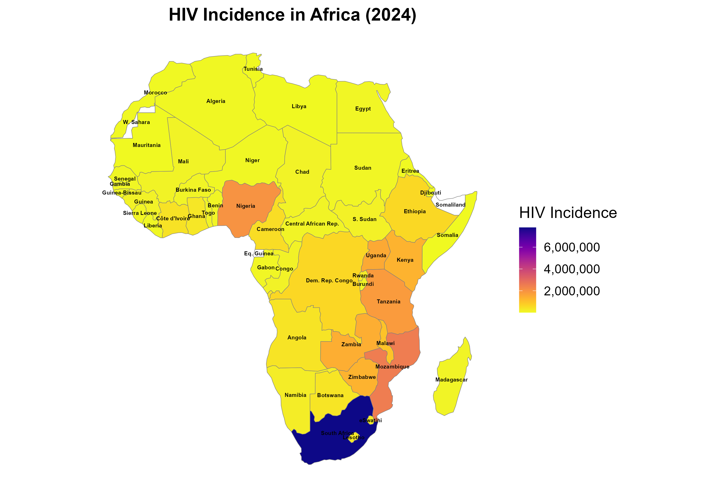

# 📊 An Ecological and Longitudinal Analysis of the African Continent (2010–2024): Modeling AIDS-Related Mortality, ART Coverage, and HIV Incidence Across 54 Countries


### 🧠 Author: Uthman Al-Ameen Olalekan  
*MPH, University of Ibadan, Nigeria*  
*PhD Candidate in Epidemiology*

---

## 📌 Overview


This project presents a comprehensive longitudinal analysis of HIV-related indicators across all 54 African countries from 2010 to 2024, covering 810 country-year observations, derived from a larger raw dataset of 2,916 rows. The analysis, including data cleaning, statistical modeling, and geospatial visualizations, was independently conducted using R.

Unlike many previous studies that primarily focus on Sub-Saharan Africa, this research provides a truly continental-wide perspective by incorporating all seven countries of North Africa, often underrepresented in comparative analyses. By including both Sub-Saharan and North African countries, this project addresses a critical research gap and offers a more comprehensive understanding of HIV-related trends across the entire African continent.

This study is currently under review at the International Journal of Epidemiology (2024 Impact Factor: 5.9; 5-Year Impact Factor: 8.3)
This repository provides all code, datasets, and outputs to promote transparency and reproducibility

---

## 🧪 Objective

To examine the trends and relationships between:

- **HIV Incidence Rate**
- **ART Coverage (%)**
- **AIDS-Related Mortality Rate**

...across African countries, and identify regional patterns and epidemiological insights using reproducible data science workflows.

---

## 📂 Data Sources

- [UNAIDS](https://aidsinfo.unaids.org/)
- [World Health Organization (WHO)](https://www.who.int/data)
- [World Bank DataBank](https://databank.worldbank.org/)

> 📝 Note: Africa comprises 54 countries, but only 51 had complete records across the variables studied. Therefore the final analysis was based on 51 countries.

---

## 🔧 Methods

- **Data Wrangling:** Cleaning, merging, reshaping, and handling missing data  
- **Imputation:** Scientific midpoint approximation for values represented as ranges (e.g., "<200")  
- **Statistical Analysis:**
  Data Cleaning & Standardization

- Descriptive Statistics & Extreme Value Identification

- Correlation Analyses (Spearman & Pearson)

- Multiple Linear Regression

- Panel Regression (Fixed Effects Model)

- Growth Curve Modeling (Multilevel Mixed Effects)


- **Visualizations:**
  - Line plots of longitudinal trends
  - Geographic Mapping using ggplot2 and sf  

---

## 📈 Sample Visualizations

<!-- Replace with your uploaded images -->
  
  


---

## 🗂️ Project Structure

```bash

📦 HIV-Continental-Study-Africa
├── data/
│   ├── raw/                   # Original downloaded datasets
│   └── cleaned/               # Cleaned and processed datasets
├── scripts/
│   ├── 01_data_wrangling.R
│   ├── 02_visualization.R
│   └── 03_analysis.R
├── output/
│   └── plots/                 # Exported charts and graphs
├── README.md                  # Project summary and instructions
└── HIV_Continental_Analysis_Report.pdf
```

## 📊 Key Findings

- Large disparities in ART coverage, ranging from 1% to 96% across countries.

- South Africa remains the epicenter of HIV incidence and AIDS-related mortality.

- Higher ART coverage is significantly linked to reduced HIV incidence and mortality.

- Spatial maps reveal clear geographic inequalities in HIV outcomes.

- Growth curve and panel regression models confirm ART scale-up reduces AIDS mortality over time.
---
# How to Reproduce
1. Clone the repository 

```
git clone https://github.com/uthmanolanase/HIV-Continental-Study-Africa.git
 ```
2. Ensure you have R installed with required packages (tidyverse, plm, lme4, sf, ggplot2, viridis, etc.).

3. Run the HIV_Africa_Analysis.R script step-by-step.
4. All outputs, including clean datasets and maps, will be generated in the outputs/ folder.
## 🎓 Academic Relevance

This project reflects **doctoral-level independence**, coding proficiency, and strong epidemiological reasoning. It was **entirely conceptualized, coded, and authored by the researcher** and serves as a foundation for high-level research, international conference presentation, and PhD/postdoctoral applications in global health and epidemiology.

---
## 🤝 Contributions

This project was independently designed, analyzed, and documented by Uthman Olalekan Al-Ameen as part of a self-driven effort to promote data-driven health research in Africa.

---
---🔗 License
This project is shared for educational and research purposes. Please contact the author for permission before reuse.
## 📫 Contact

**Uthman Al-Ameen Olalekan**  
📧 uthmanolanase01@gmail.com  
🔗 [View Full Project on GitHub](https://github.com/uthmanolanase/HIV-Continental-Study-Africa)  
🧾 CV available upon request

---

## 🔗 Citation

> Uthman, A. (2025). _Continental Analysis of HIV Incidence, ART Coverage, and AIDS-related Mortality in Africa, 2000–2024_. Manuscript Submitted to * _International Journal of Epidemiology_*.
---
